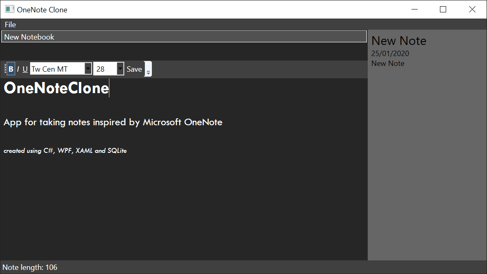

# OneNote Clone

App for taking notes inspired by Microsoft OneNote, created using C#, WPF, XAML and SQLite

## Features
___
* Creating and naming individual notebooks that store notes assigned to them

* Taking notes with a built-in text editor supporting text decorations like **bold**, *italic*, <u>underline</u> and various font families and sizes
* Saving notes as files and ability to edit them

## Setup
___

Run the provided installer that will guide you through the installation process

## Built With
___
* [Microsoft Visual Studio](https://visualstudio.microsoft.com/) - used IDE
* [SQLite](https://www.sqlite.org/index.html) - NuGet package used to provide database support

## Authors
___
|Name            | GitHub page                     | 
|--------------- |---------------------------------|
|Filip Kmiecik   | https://github.com/filipkmiecik |
|Mateusz Hartabus| https://github.com/Paaka        |

